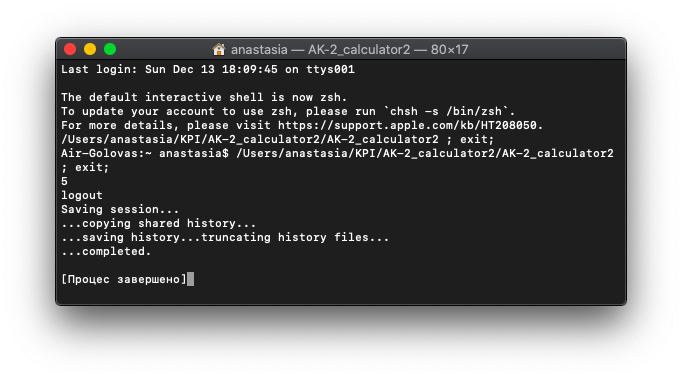

# AK-2 Lab2 
## Виконала: Головаш Анастасія 
## Група: ІВ-82

## Лістинг:
### main.cpp
```
#include "calculator.h"
#include "iostream"
int main ()
{
	Calculator x;
	std::cout<<x.Add(2, 3)<<std::endl;
	return 0;
}
```

### calculator.cpp
```
#include "calculator.h"

int Calculator::Add (double a, double b)
{
	return a + b + 0.5;
}

int Calculator::Sub (double a, double b)
{
	return Add (a, -b);
}
```

### calculator.h
```
#ifndef CALCULATOR_H
#define CALCULATOR_H

class Calculator
{
	public:
		int Add (double, double);
		int Sub (double, double);
};

#endif//CALCULATOR_H
```

### Makefile.mk
```
lab2: main.o calculator.o
	g++ -o lab2 main.o calculator.o
main.o: main.cpp 
	g++ -c main.cpp
calculator.o: calculator.cpp
	g++ -c calculator.cpp

clean: 
	rm lab2
	rm main.o
	rm calculator.o
```

### CMakeLists.txt
```
project("AK-2_calculator2")
 
add_library(calculator STATIC calculator.cpp)
add_executable("${PROJECT_NAME}" main.cpp)
target_link_libraries("${PROJECT_NAME}" calculator)
```

## Результат роботи виконуваного файлу:


## Висновок:
В даній роботі я навчилася створювати сценарій збірки для системи збирання 'Ninja'.
